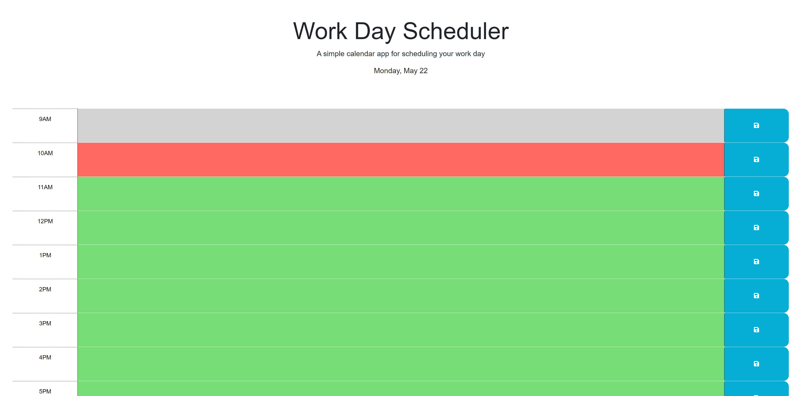
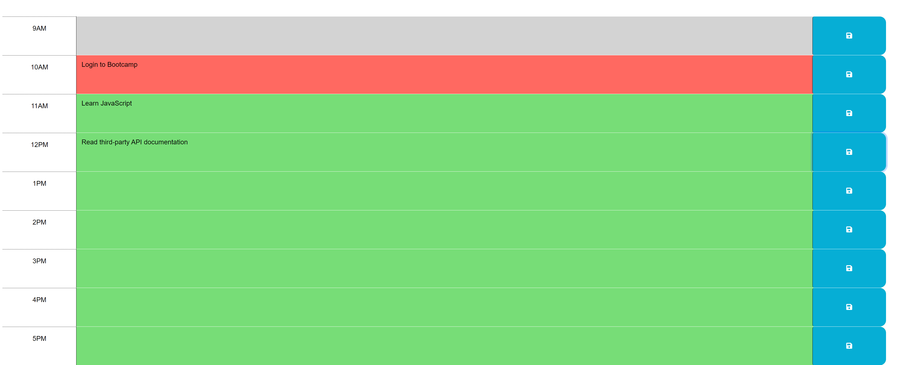
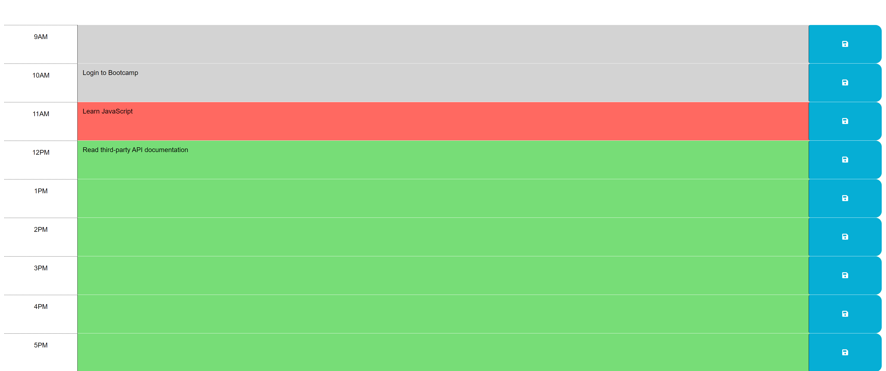

# Skeleton Planner

## Description
---
Skeleton planner is a bare-bones day planner that allows the user to save upcoming events. The planner allows you to write in the event, save the event, and will display if the event has past, is during the current hour, or in a future hour. The planner is formatted for a typical 8 hour work day from 9am to 5pm.

## Installation
---
N/A

## Usage
---
When opening the application you are presented with this page.

From there you can then add today's tasks to the planner and then save by pressing the save button to the right of the page.

Once saved, the tasks will still be applied to the page after each refresh. The application auto refreshes every 5 minutes to update the page and change the color of the text area based on the time of day.

# References

- https://github.com/lbmoody/simple-day-planner
- https://codepen.io/judebloom/pen/RwGbVWB

# Application URL

- 
